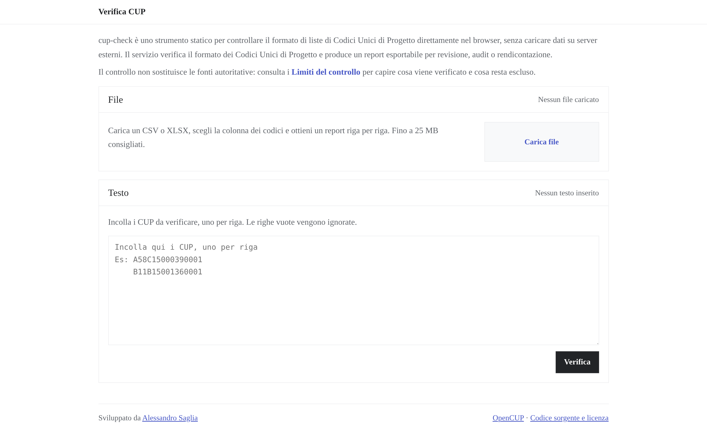

# cup-check

> Local-first support tool for checking Italian public project codes (CUP) before administrative reporting, with static OpenCUP lookup and a Python library.

**[Web app](https://ale-saglia.github.io/cup-check/)** · [Python package](https://pypi.org/project/cup-check/) · [Documentazione](docs/product.md)

Nella rendicontazione di progetti pubblici, fondi PNRR e programmi finanziati, un CUP scritto male può bloccare controlli, rallentare pratiche e generare correzioni costose. Verificare manualmente centinaia o migliaia di codici prima di una trasmissione ufficiale e un'attività ripetitiva, lenta e soggetta a errore.

`cup-check` nasce per ridurre questo attrito operativo: aiuta funzionari, consulenti e team tecnici a controllare in batch liste di CUP prima di rendicontazioni, caricamenti o verifiche amministrative, intercettando rapidamente errori formali e assenze dal perimetro OpenCUP disponibile.

Il progetto mantiene una postura cautelativa: distingue il formato valido dalla verifica di esistenza, usa un dataset OpenCUP statico e versionato quando disponibile, e non presenta mai il risultato come certificazione autoritativa.

`cup-check` include una web app statica per controllare liste di CUP direttamente nel browser e una libreria Python importabile per usare lo stesso validatore in script, pipeline e applicazioni. La verifica controlla il formato (regole `R0`-`R5`) e, quando il dataset OpenCUP statico è disponibile, la presenza del CUP nel mirror pubblicato. Se il dataset non è disponibile, un CUP formalmente valido resta `FORMATO_VALIDO_DA_VERIFICARE`. Da `0.4.0` la web app include anche un tool per estrarre CUP da fatture PDF, con testo nativo e OCR locale in italiano come fallback per documenti scansionati.

## English Abstract

`cup-check` is an open source, local-first tool for checking Italian CUP codes used in public investment projects before administrative reporting, uploads or downstream validation. It helps public administrations and technical teams review large CUP lists, find format errors and compare codes with a static OpenCUP mirror.

The project is designed for zero operational cost, browser-side processing, auditable rules and cautious outcomes. It is not an authoritative certification service: final existence checks still belong to the official CUP/OpenCUP channels.

## Stato

**Versione corrente: 0.4.0** — web app statica, package Python `cup-check` su PyPI, tool di estrazione CUP da PDF.

Il dataset OpenCUP statico è uno snapshot mensile; il numero di CUP indicizzati è riportato nel `dataset-manifest.json` della release corrente.

**Roadmap**: `0.4.0` in consolidamento · `0.5.0` in progettazione (UX & accessibilità WCAG AA, batch >100k con Web Worker) · [dettaglio completo](docs/roadmap.md).

## Cosa Fa

- Valida CUP da file CSV e XLSX.
- Valida CUP incollati come testo, uno per riga.
- Verifica la presenza nel dataset OpenCUP statico quando il dataset è disponibile.
- Mostra risultati filtrabili per esito e testo.
- Mostra ed esporta i risultati raggruppati per CUP o riga per riga.
- Funziona offline dopo la prima visita.
- Espone una libreria Python installabile come `cup-check`.

## Strumenti

### Estrai CUP da fatture PDF

Disponibile nel menu "Strumenti" della web app, il tool estrae automaticamente i codici CUP da uno o più file PDF:

1. Apri il menu **Strumenti** e scegli **Estrai CUP da fatture PDF**.
2. Carica uno o più PDF tramite la zona di rilascio o il selettore file.
3. Il tool legge il testo nativo con pdf.js; se il documento è scansionato usa OCR locale in italiano (Tesseract.js, nessuna rete esterna).
4. Controlla la tabella file/CUP, correggi manualmente eventuali letture imperfette.
5. Clicca **Apri nel verificatore** per passare l'elenco estratto al verificatore principale, oppure **Esporta CSV** per scaricare il file `cup,file_origine` direttamente.

Il tool mostra la validazione formale del CUP (regex + checksum). La verifica di esistenza nel dataset OpenCUP avviene solo nel verificatore principale, dopo il passaggio. I file PDF sono elaborati interamente nel browser; nessun dato viene trasmesso a server esterni.

## Privacy

File CSV/XLSX e testi incollati vengono elaborati localmente nel browser. L'app non carica i CUP, i file o i report su un backend applicativo.

La web app recupera il dataset OpenCUP statico come asset pubblico e cacheabile, senza servizi server-side applicativi. I file caricati dagli utenti e i report restano elaborati localmente.

## Contesto PA e Open Source

Il progetto è rilasciato con licenza EUPL-1.2 ed è strutturato per essere valutabile in contesti di adozione, integrazione o condivisione nella Pubblica Amministrazione, in coerenza con i principi delle Linee guida AGID su acquisizione e riuso del software.

`cup-check` non è un servizio ufficiale né una fonte autoritativa: fornisce controlli locali, auditabili e cautelativi a supporto dei processi amministrativi.

## Limiti Del Controllo

`cup-check` è in fase di sviluppo: può contenere errori, bug o interpretazioni
incomplete delle regole. I risultati sono un supporto operativo, non una
certificazione.

La verifica OpenCUP usa una banca dati generata mensilmente: potrebbe non
includere gli ultimi CUP emessi, CUP non ancora pubblicati o record aggiornati
dopo l'ultimo snapshot.

Gli esiti possibili sono:

- `INVALIDO_FORMATO` — il CUP non rispetta le regole strutturali.
- `FORMATO_VALIDO_DA_VERIFICARE` — il CUP rispetta le regole strutturali, ma il dataset non è disponibile.
- `TROVATO_OPENCUP` — CUP presente nel mirror OpenCUP disponibile.
- `NON_TROVATO_OPENCUP_DA_VERIFICARE` — CUP non presente nel mirror OpenCUP disponibile; richiede verifica cautelativa e potrebbe comunque esistere.

Per attestare l'esistenza di un progetto resta necessario il Sistema CUP o il portale OpenCUP.

## Documentazione

- [Guida utente](docs/user-guide.md)
- [Sviluppo](docs/development.md)
- [Product](docs/product.md)
- [Architettura](docs/architecture.md)
- [Specifiche tecniche](docs/technical-spec.md)
- [Roadmap](docs/roadmap.md)
- [Fonti dati](docs/data-sources.md)
- [Governance](docs/governance.md)
- [Contributori](CONTRIBUTORS.md)
- [Glossario](docs/glossary.md)
- [ADR](docs/adr/)

## Contribuire

Il progetto accetta contributi coerenti con la roadmap e con i vincoli di governance. Vedi [CONTRIBUTING.md](CONTRIBUTING.md) per processo, convenzioni e regola fixture-first.

## Licenza

EUPL-1.2. Vedi `LICENSE`.
